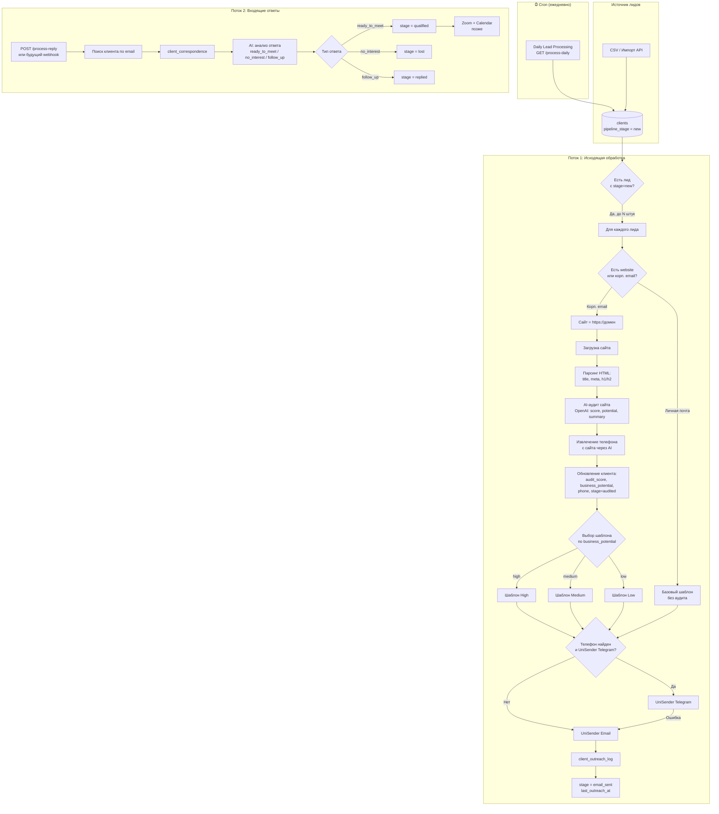
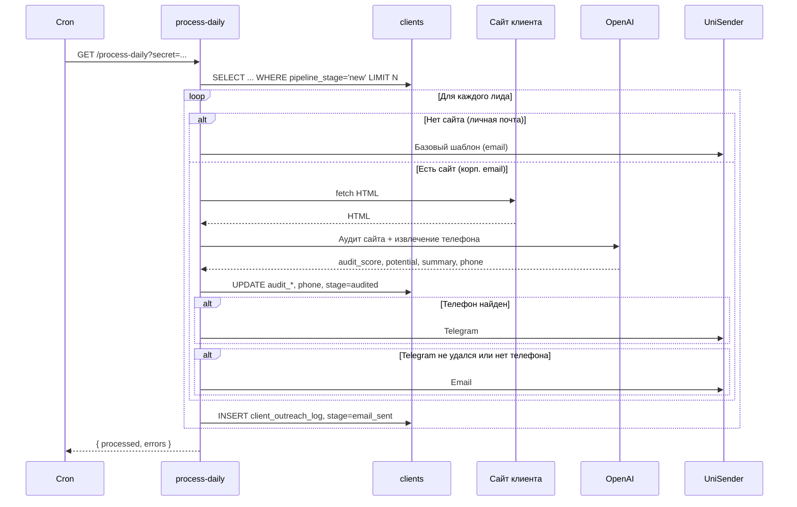
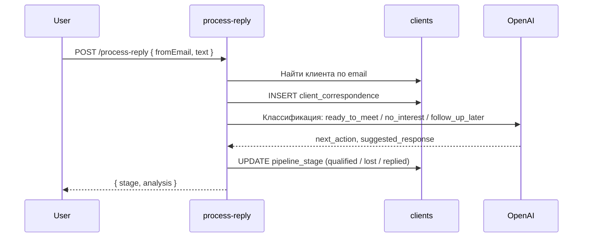

# Визуализация пайплайна холодных лидов

Ниже — схема того, как работает система (аналог твоего n8n-воркфлоу внутри платформы).

---

## Общая схема

---

## Поток 1: Исходящая обработка (по шагам)

---

## Поток 2: Обработка ответа клиента

---

## Где что настраивается

| Что | Где |
|-----|-----|
| Частота запуска | Cron на сервере (например, раз в день в 9:00). |
| Сколько лидов за раз | Переменная `SALES_PIPELINE_BATCH_SIZE` в `.env` (по умолчанию 10). |
| Лимит писем за один запуск | Переменная `SALES_PIPELINE_MAX_EMAILS_PER_RUN` в `.env` (опционально). |
| Шаблоны писем | UniSender: создаёшь шаблоны, подставляешь переменные. Тексты сценариев — в `SALES_PIPELINE_EMAIL_TEMPLATES.md`. |

Диаграммы можно смотреть в VS Code (плагин Mermaid), на GitHub или в любом редакторе Mermaid.
